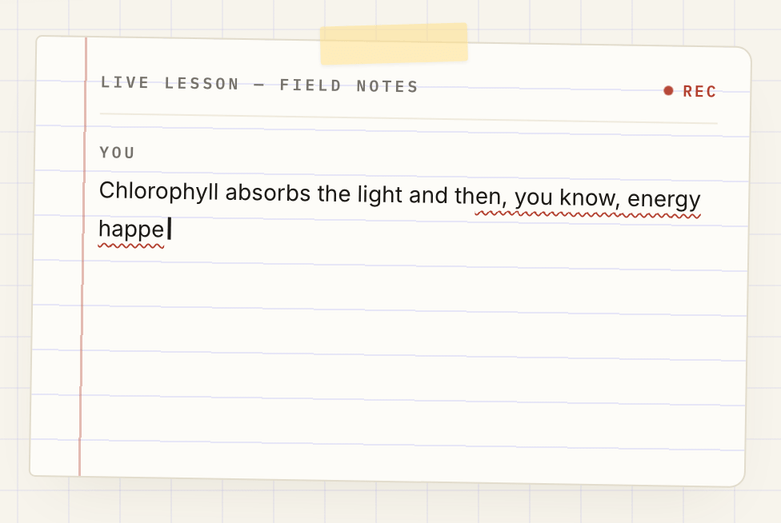
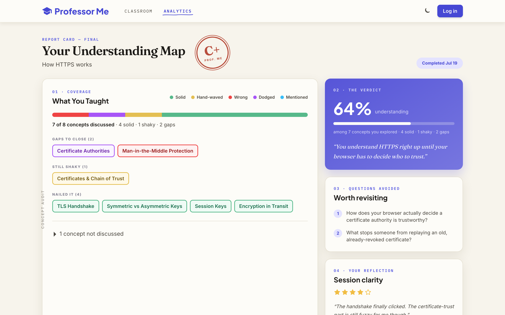
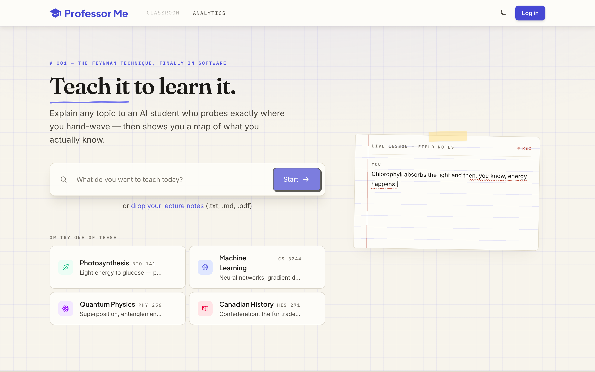
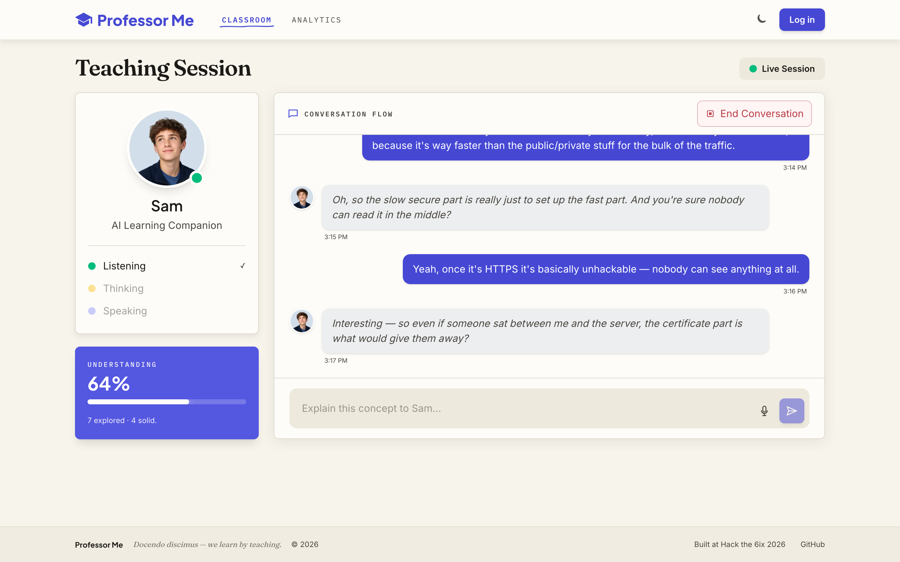
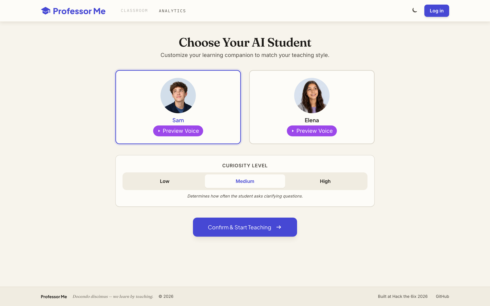
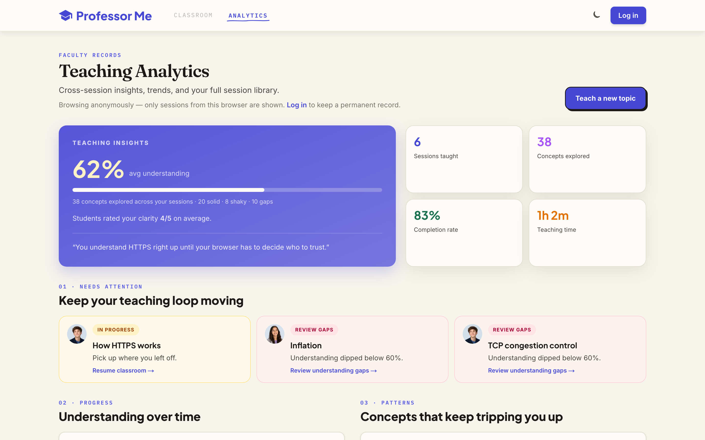
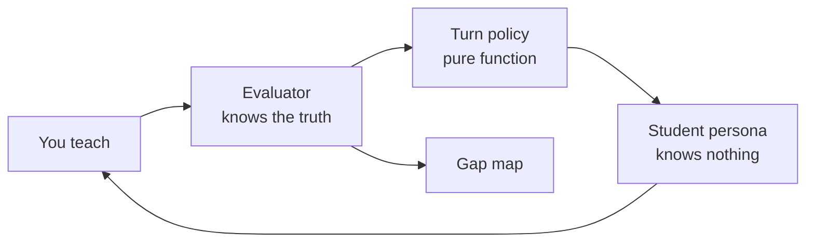

<p align="center">
  
</p>

<h1 align="center">Professor Me</h1>

<p align="center">
  <strong>Teach it to learn it.</strong><br/>
  An AI student that listens, pushes back, and shows you what you actually know.
</p>

<p align="center">
  <a href="https://professor-me.vercel.app"><strong>Live demo</strong></a> ·
  <a href="https://devpost.com/software/professor-me">Devpost</a> ·
  <a href="https://github.com/HD-Brody/Hackthe6ix2026">GitHub</a>
</p>

<p align="center">
  
  
  
  
  
</p>

<p align="center">
  
</p>

---

## The problem

Every AI study tool makes the model the teacher and you the passive student. That is the worst-performing study configuration in the learning literature.

The best-performing one is the **Feynman technique**: explain a topic out loud to someone who knows nothing, and notice exactly where you get stuck. The catch? You need a willing listener who actually engages — asks for examples when you are vague, pushes "but why?" when you hand-wave, and does not just nod along.

**Professor Me is that listener.**

---

## What it does

Pick any topic. Choose your student — **Sam** or **Elena** — and set how curious they are. Explain the topic out loud. They interrupt when you are vague, get stuck when you skip steps, and ask follow-ups like a real student would.

When the session ends, you get a **gap map**: concept-by-concept coverage, your vaguest moments pulled verbatim from the transcript, dodged questions, and a suggested re-teach order.

<p align="center">
  
</p>

| | |
|---|---|
|  |  |
| Pick a topic or upload notes | Teach Sam or Elena in a live voice session |
|  |  |
| Choose persona and curiosity | Track progress across sessions |

---

## How a session works

```
You speak  →  Evaluator grades your explanation against a concept graph
                    ↓
              Turn policy decides: probe · deepen · advance · wrap up
                    ↓
              Persona reacts in character  →  ElevenLabs speaks back
                    ↓
              Session ends  →  Gap map with verbatim quotes
```

1. **Topic in** — type a subject or upload notes; Gemini extracts teachable subtopics.
2. **Graph built** — 8–15 concept nodes are generated with ground truth, prerequisites, and probe angles.
3. **You teach** — voice-first (Web Speech API in, streaming ElevenLabs out) with a text fallback.
4. **Student probes** — the persona only knows the conversation; the evaluator secretly scores every utterance.
5. **Gap map out** — coverage states (`solid` / `vague` / `wrong` / `dodged` / `unvisited`), your sharpest weak moments, and a one-liner that stings correctly.

---

## Under the hood

One model cannot be dumb and strategic at the same time. A single "act confused but probe intelligently" prompt collapses into either a yes-man or a student who accidentally reveals knowledge they should not have.

Professor Me splits the brain:



| Component | Role |
|---|---|
| **Evaluator** (Gemini) | Holds the concept graph. Scores each utterance as solid, vague, wrong, or dodged. Never talks to the user. |
| **Turn policy** (TypeScript) | Decides the next move: `PROBE`, `DEEPEN`, `ADVANCE`, or `WRAP_UP`. Unit-tested — no guessing in prod. |
| **Persona** (Gemini) | Receives only the transcript + a directive. Converts strategy into natural, in-character speech. |
| **Gap map** (Gemini + validation) | Quotes are checked word-for-word against your transcript. Paraphrased quotes get swapped out. |

### Engineering highlights

- **Parallel evaluation** — evaluator and persona run concurrently where possible (~1.2s median savings per turn).
- **Browser-side TTS** — ElevenLabs streams directly in the client (restricted API key) because Vercel cannot hold a websocket open server-side.
- **Frozen contracts** — shared JSON schemas in `contracts/` keep four parallel workstreams from stepping on each other.
- **Re-teach memory** — prior gap maps can seed a new session so the student opens with *"last time you couldn't explain X — try me again."*

---

## Tech stack

| | |
|---|---|
| **App** | Next.js 15 · React 19 · TypeScript · Tailwind CSS 4 |
| **AI** | Google Gemini 2.5 (flash + pro tier split) |
| **Voice** | ElevenLabs streaming TTS · Web Speech API STT |
| **Data** | MongoDB Atlas |
| **Auth** | Auth0 |
| **Deploy** | Vercel |

---

## Run it locally

**Prerequisites:** Node.js 20+, plus API keys for Gemini, ElevenLabs, MongoDB Atlas, and Auth0.

```bash
git clone https://github.com/HD-Brody/Hackthe6ix2026.git
cd Hackthe6ix2026
npm install
cp .env.example .env.local   # fill in keys — see below
npm run dev                    # http://localhost:3000
```

### Minimum env setup

```bash
# AI
GEMINI_API_KEY=...

# Voice (browser TTS key must be TTS-only — create a restricted key in ElevenLabs)
NEXT_PUBLIC_ELEVENLABS_TTS_KEY=...

# Database
MONGODB_URI=...

# Auth (generate secret: openssl rand -hex 32)
AUTH0_SECRET=...
AUTH0_DOMAIN=...
AUTH0_CLIENT_ID=...
AUTH0_CLIENT_SECRET=...
APP_BASE_URL=http://localhost:3000
```

**Local dev without API costs:**

```bash
ECHO_MODE=true      # canned student replies, no Gemini calls
LLM_MOCK=true       # mock evaluator + persona
BILLING_MOCK=true   # skip crypto checkout on /support
```

See [`.env.example`](.env.example) for Vertex AI, model tiers, feature flags, and Unifold tip integration.

### Useful scripts

| Command | What it does |
|---|---|
| `npm run dev` | Start the dev server |
| `npm test` | Unit tests (turn policy, prompts, gap map validation) |
| `npm run eval` | LLM prompt eval harness |
| `npm run seed-demo` | Seed demo session data |
| `npm run cp2:integration` | Full text-loop integration drill |

---

## Project layout

```
src/
├── app/           Pages + API routes
├── components/    Classroom, gap map, analytics, profile
├── llm/           Prompts, Gemini client, evaluator, persona
├── server/        Orchestrator, MongoDB, billing
├── voice/         STT/TTS clients, latency tooling
└── lib/           Shared types, SSE, student profiles

contracts/         JSON schemas — the cross-team contract
fixtures/graphs/   Vetted concept graphs for testing
docs/              Design doc, build plan
```

---

## Team

Built in 36 hours at **Hack the 6ix 2026** by:

[**Anushka Tankala**](https://www.linkedin.com/in/anushka-tankala-0725a52b4/) · [**Ariel Vainer**](https://www.linkedin.com/in/arielvainer/) · [**Jueun Yoon**](https://www.linkedin.com/in/joonyee/) · [**Brody Honigman Deltoff**](https://www.linkedin.com/in/brody-hd/)

---

## What's next

- More student personas with distinct personalities
- Cross-session memory across topics
- Richer notes upload — select specific subtopics to focus on

---

<p align="center">
  <em>Docendo discimus — we learn by teaching.</em>
</p>
